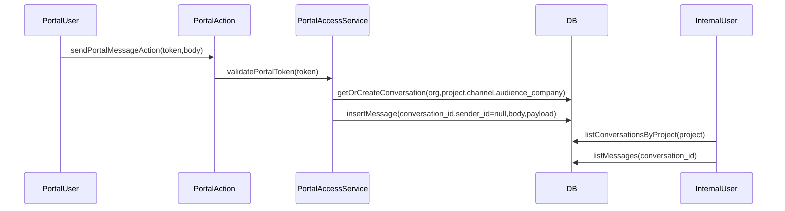

# Messaging MVP (construction-grade) — product + DB gameplan

## What you have today (key findings)

- **Portal messages are scoped only by `(org_id, project_id, channel)`**, so all portal tokens for a given channel share one conversation.
  - The conversation lookup/creation is here:
```318:350:lib/services/portal-access.ts
async function getOrCreatePortalConversation({
  orgId,
  projectId,
  channel,
}: {
  orgId: string
  projectId: string
  channel: "client" | "sub"
}) {
  const supabase = createServiceSupabaseClient()
  const { data: existing } = await supabase
    .from("conversations")
    .select("id")
    .eq("org_id", orgId)
    .eq("project_id", projectId)
    .eq("channel", channel)
    .maybeSingle()

  if (existing) return existing.id

  const { data, error } = await supabase
    .from("conversations")
    .insert({
      org_id: orgId,
      project_id: projectId,
      channel,
    })
    .select("id")
    .single()

  if (error) throw new Error(`Failed to create conversation: ${error.message}`)
  return data.id as string
}
```

- **Subcontractor privacy is currently broken** (given your decision “private per subcontractor company”), because `listPortalMessages` loads all messages for the shared conversation with no filter by token/company.
```352:385:lib/services/portal-access.ts
export async function listPortalMessages({
  orgId,
  projectId,
  channel,
}: {
  orgId: string
  projectId: string
  channel: "client" | "sub"
}): Promise<PortalMessage[]> {
  const supabase = createServiceSupabaseClient()
  const conversationId = await getOrCreatePortalConversation({ orgId, projectId, channel })

  const { data, error } = await supabase
    .from("messages")
    .select("id, org_id, conversation_id, sender_id, message_type, body, payload, sent_at, sender:app_users(full_name, avatar_url)")
    .eq("org_id", orgId)
    .eq("conversation_id", conversationId)
    .order("sent_at", { ascending: true })

  if (error) throw new Error(`Failed to load portal messages: ${error.message}`)

  return (data ?? []).map((row: any) => ({
    id: row.id,
    org_id: row.org_id,
    conversation_id: row.conversation_id,
    sender_id: row.sender_id ?? undefined,
    message_type: row.message_type,
    body: row.body,
    payload: row.payload ?? {},
    sent_at: row.sent_at,
    sender_name: row.sender?.full_name ?? row.payload?.sender_name ?? "Portal user",
    sender_avatar_url: row.sender?.avatar_url ?? undefined,
  }))
}
```

- **DB mismatch risk**: your migrations define `messages.sender_id` as nullable, but your “production schema reconciliation” file shows it as NOT NULL. Your portal writer explicitly sets `sender_id: null`.
```428:475:lib/services/portal-access.ts
  const { data, error } = await supabase
    .from("messages")
    .insert({
      org_id: orgId,
      conversation_id: conversationId,
      sender_id: null,
      message_type: "text",
      body,
      payload: { sender_name: senderName ?? "Portal user", portal_token_id: portalTokenId },
    })
```


## Product MVP: what “essential” means in construction

Messaging in construction is valuable **only if it reduces phone/SMS chaos and preserves decisions**. The MVP should prioritize:

- **Privacy-correct conversations** (especially subs)
- **Context-first threads** (messages attached to project entities)
- **Photos/files** (most messages in the field are photo-driven)
- **Unreads + notifications** (otherwise nobody trusts it)
- **Decision/auditability** (search + export)

## Proposed MVP scope (4–6 weeks, depending on attachments)

### Core UX

- **Project message center for internal users**: 
  - Client thread (single per project)
  - Subcontractor threads (one per subcontractor company)
  - Conversation list (sortable by last activity)
- **Portal messaging**:
  - Client portal thread = client ↔ GC/PM only
  - Sub portal thread = subcontractor company ↔ GC/PM only
- **Entity-linked threads** (MVP):
  - RFIs + Submittals: keep “message thread” per entity, visible inside that entity view
  - (Optional next) Change Orders, Selections, Punch items

### Essential features

- **Attachments (photos + files)**
  - Reuse your existing `files` + `file_links` by linking `entity_type='message'` and `entity_id=message.id`.
- **Unread/Read tracking**
  - Per internal user per conversation.
  - (Optional) for portal users too, if you want “unread badge” in the portal.
- **Notifications**
  - On new message: internal users subscribed to that project get an in-app notification (and optionally email/push later).
- **Search (phase 1.5)**
  - Search messages by text + filter by project/company/entity.

### Explicitly out of MVP

- Full “Slack replacement” (channels, DMs, emojis, etc.)
- Calling/voice, offline-first, advanced moderation

## DB gameplan (minimal but correct)

### 1) Fix subcontractor privacy at the data model level

Add a **conversation audience key** so a “sub” conversation is not global.

- Add to `conversations`:
  - `audience_company_id uuid null references companies(id)`
  - `audience_contact_id uuid null references contacts(id)` (optional; can be omitted if you standardize on company)
  - `last_message_at timestamptz` (optional but very helpful)

Create a **unique index** for your lookup pattern:

- Unique on `(org_id, project_id, channel, audience_company_id)`
  - For client conversations, `audience_company_id` should be the client company.
  - For sub conversations, `audience_company_id` is the subcontractor company.

This prevents the “maybeSingle but multiple rows” failure mode and makes your “get or create” safe under concurrency.

### 2) Align nullability with actual usage

Given the portal writer sets `sender_id = null`, **`messages.sender_id` must be nullable**.

Also, decide now whether you want to support:

- **text-only** (keep `body NOT NULL`), or
- **attachments-only** messages (allow `body NULL` but require at least one attachment)

I recommend allowing `body` nullable eventually, but the MVP can keep `body NOT NULL` and require some text.

Similarly for `conversations`:

- If DB currently requires `subject`/`created_by`, either:
  - relax those constraints, or
  - enforce defaults at insert time (recommended for `subject`, optional for `created_by`).

### 3) Add read/unread tracking

Create `conversation_read_states`:

- `org_id`, `conversation_id`, `user_id` (internal) and optionally `contact_id` (portal)
- `last_read_at` and/or `last_read_message_id`
- indexes on `(conversation_id, user_id)` and `(conversation_id, contact_id)`
- RLS same pattern as other tables: service_role OR `is_org_member(org_id)`

### 4) Attachments via existing tables

Prefer reusing:

- `file_links` with `entity_type='message'` and `entity_id=<message_id>`
- Add an index on `file_links(entity_type, entity_id)` if not present, to make message attachment fetch fast.

## Code changes (high-level)

- Update portal conversation resolution in [`lib/services/portal-access.ts`](lib/services/portal-access.ts):
  - `getOrCreatePortalConversation` should key on `(org_id, project_id, channel, audience_company_id)`.
  - For **sub portals**, use `portal_access_tokens.company_id` as `audience_company_id`.
  - For **client portals**, use the client’s `company_id` if present; otherwise fall back to `contact_id` or “single client convo” but be explicit.
  - Stop relying on message `payload.portal_token_id` for scoping.

- Update project messages page `[app/(app)/projects/[id]/messages/page.tsx](app/(app)/projects/[id]/messages/page.tsx)` and client `[app/(app)/projects/[id]/messages/project-messages-client.tsx](app/(app)/projects/[id]/messages/project-messages-client.tsx)`:
  - Instead of a single “Subcontractors” thread, show a conversation list grouped by subcontractor company.

- Update entity message threads (RFIs/Submittals):
  - Either keep using payload filters (fastest) or migrate to true “entity conversations” (cleaner). MVP can keep payload filters, but ensure they’re scoped to the correct company conversation.

### Recommended data flow



## Risks / gotchas to address early

- **Subcontractor privacy** is the biggest: it’s currently a cross-company data leak at the app level.
- **Schema drift**: your `20251220_production_schema_reconciliation.sql` indicates stricter constraints than your migrations. Before deploying DB changes, confirm which represents reality in your live Supabase.
- **RLS vs service_role**: portal uses service role client, so privacy must be enforced in your queries and schema (not just RLS).

## Rollout plan

- Ship DB changes first (non-breaking where possible)
- Migrate existing “sub” messages:
  - If you already have multiple subcontractors using the portal, you’ll need a backfill strategy to split legacy messages (if you can’t, you may need to start “new threads going forward” and keep legacy read-only).
- Update portal + internal UI to use per-company conversations
- Add read/unread and notifications
- Add attachments (reuse `files` + `file_links`)