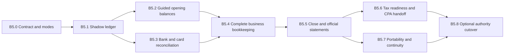

# Plan 001: Arc Books — staged QBO independence

- **Priority:** P0
- **Status:** Implemented in code; migration and human rollout gates pending
- **Effort:** L / multi-quarter
- **Risk:** High
- **Category:** Product direction and accounting architecture
- **Repository baseline:** `4ad9b11`
- **Depends on:** A corrected and CPA-approved Arc Books B4 ledger design

## Executive decision

Do not defer the B5 destination. Decompose it.

Arc Books should be included in the Arc subscription rather than sold as a separate accounting subscription. Availability should be controlled by operational readiness, not a pricing paywall. Each organization chooses whether an external accounting system or Arc owns the official ledger; Arc must continue supporting QBO and future accounting-provider integrations for organizations that never choose Arc as their ledger of record.

Ledger authority and integration state are separate decisions:

- **External authoritative:** QBO or another provider is the official ledger. Arc integrates with it and may run its own ledger in shadow for financial intelligence and reconciliation.
- **Parallel validation:** both ledgers are closed and compared while the external system remains official.
- **Arc authoritative with external mirror:** Arc is official but sends controlled, one-way accounting output to an external system when an accountant, lender, or company policy requires it.
- **Arc only:** Arc is official and the organization chooses to disconnect its external accounting system.

An organization can therefore use Arc indefinitely in external-authoritative mode. B5.8 is an optional, organization-scoped transition; it never removes QBO or other provider support from the Arc product.

The product promise should be:

> A small US builder can run daily bookkeeping, reconcile cash and cards, close a period, produce reliable financial statements, and hand complete books to an accountant without maintaining QuickBooks Online.

That promise does **not** require Arc to become a payroll processor or tax-return preparation product. Those can remain partner workflows. Direct tax filing, multi-entity consolidation, multi-currency, inventory accounting, and production-home/lot accounting should remain outside the first independence release.

Bundling the software does not require Arc to absorb unlimited third-party costs. Bank connectivity, identity verification, and information-return filing may need fair-use limits or transparent pass-through fees while the Books capability itself remains included.

## Why this is strategically strong

Procore and Buildertrend can continue expanding payments, AP, waivers, and financial integrations. Arc is harder to displace if it owns the complete economic record of a small builder: contract, commitment, cost, invoice, payment, bank transaction, WIP recognition, journal posting, close, and financial statement.

The differentiation is not “we added a general ledger.” It is that the ledger is native to construction operations, so users do not reconcile two competing versions of project truth.

This is also the highest-trust area of Arc. A broken task workflow is inconvenient; an incorrect closed period or balance sheet can damage tax work, financing, and owner decisions. B5 therefore needs explicit gates, parallel closes, auditability, and reversible cutover—not one large feature launch.

## What “independent from QBO” means

An organization is independent only when Arc can support all of the following:

1. Maintain an organization chart of accounts and an immutable, balanced journal.
2. Record project and non-project income, expenses, assets, liabilities, equity, and transfers.
3. Maintain open receivables and payables, including credits, refunds, write-offs, retainage, and customer deposits.
4. Import bank and credit-card activity and reconcile it to statements.
5. Close and reopen organization accounting periods under controlled permissions.
6. Produce a trial balance, general ledger, profit and loss, balance sheet, cash-flow statement, AR/AP aging, WIP, and project profitability with drill-down to source records.
7. Prepare year-end contractor information and a complete accountant handoff package.
8. Export the full accounting record in usable formats and rebuild the ledger from immutable source/posting facts.
9. Complete a guided, approved change of ledger authority. Depending on the organization’s choice, either replace bidirectional synchronization with a controlled outbound mirror or disconnect the external accounting system.

Arc should not market “QBO replacement” for an organization before that organization has passed the Arc-authoritative gate. This positioning must coexist with a first-class “works with your accounting system” story.

## Current-state evidence

At baseline `4ad9b11`:

- [`lib/integrations/accounting/provider.ts`](../lib/integrations/accounting/provider.ts) recognizes only `qbo` as an accounting provider and models outbound accounting capabilities.
- [`lib/services/accounting-connections.ts`](../lib/services/accounting-connections.ts) disconnects a connection by changing its status and emitting events; it is not yet an accounting cutover workflow.
- [`lib/services/accounting-export.ts`](../lib/services/accounting-export.ts) exports AP, job-cost, or generic journal CSV data, not a portable complete set of books.
- [`lib/reports/definitions/financial.ts`](../lib/reports/definitions/financial.ts) includes strong construction reports, but not a trial balance, P&L, balance sheet, cash-flow statement, or general-ledger detail report.
- [`lib/services/billing-periods.ts`](../lib/services/billing-periods.ts) closes project billing periods. It does not implement an organization-wide accounting close.
- [`lib/services/reports/vendor-1099.ts`](../lib/services/reports/vendor-1099.ts) hard-codes a $600 threshold and has only partial tax identity data. Tax rules must be effective-dated and the filing workflow needs secure full-TIN handling.
- [`supabase/migrations/20260711120100_vendor_tax.sql`](../supabase/migrations/20260711120100_vendor_tax.sql) stores TIN last-four and W-9 metadata, which is suitable for ordinary UI but insufficient by itself for information-return filing.
- Existing QBO import machinery can help with comparison and cutover, but it is not a guided opening-balance package with subledger tie-outs and approval.

Before starting any stage, compare current code with this baseline:

```bash
git rev-parse HEAD
git diff --stat 4ad9b11..HEAD
git diff 4ad9b11..HEAD -- docs/arc-books-gameplan.md lib/integrations/accounting lib/services/accounting-connections.ts lib/services/accounting-export.ts lib/services/billing-periods.ts lib/services/reports/vendor-1099.ts lib/reports/definitions/financial.ts supabase/migrations
```

If those areas have materially changed, update the relevant stage plan before implementing it.

## Program shape

This is a master roadmap, not a one-branch implementation plan. Each numbered stage must become its own execution plan and normally its own pull request or small sequence of pull requests. Do not implement multiple stages as a single migration or release.



## B5.0 — Define the accounting contract and operating modes

### Goal

Remove ambiguity before code makes accounting policy permanent.

### Deliverables

- Define supported organizations for the first release: one US legal entity, USD functional currency, small custom builder/remodeler/design-build firm, accrual books with explicitly defined cash-basis reporting behavior.
- Model two independent organization-level concepts rather than one overloaded mode:
  - `ledger_authority`: external provider or Arc;
  - `arc_ledger_mode`: disabled, shadow, parallel, or official;
  - the accounting connection separately records provider, health, and sync direction/state.
- Define supported operating postures:
  - external authoritative with normal provider integration;
  - external authoritative with Arc shadow books;
  - parallel validation;
  - Arc authoritative with an outbound external mirror;
  - Arc authoritative with no external connection.
- Define which system owns edits for every posture. When Arc is authoritative, inbound external changes must never rewrite Arc’s official journal; surface them as drift or import proposals instead.
- Keep the existing `AccountingProvider` abstraction as a permanent product boundary and expand it for future providers rather than treating QBO code as temporary scaffolding.
- Define the accounting policy matrix with a CPA: revenue recognition, WIP/percentage-of-completion, retainage, customer deposits, over/under billings, vendor credits, refunds, bad debt, owner contributions/distributions, loan payments, credit cards, payroll clearing, sales/use tax, and year-end retained earnings.
- Define posting ownership. Operational records emit immutable, versioned accounting facts; the posting engine converts those facts into balanced journal entries. Editing a source record must never silently rewrite a posted or closed-period journal.
- Define adjustment, reversal, correction, and reopen rules.
- Define roles and permissions for view, adjust, reconcile, close, reopen, cut over, and export. Reuse existing roles where semantically correct; do not overload project billing permissions for organization close.
- Decide which third-party costs are included, fair-use, or passed through.
- Write a plain-language support boundary covering payroll, tax preparation, filing, inventory, fixed assets, multi-entity, and multi-currency.

### Gate

- A licensed construction CPA approves the policy matrix and example postings.
- Product, engineering, and support agree on each ledger-authority and sync-direction support boundary.
- B4 is amended so official journals are derived from immutable accounting facts rather than mutable application rows.
- At least 30 golden accounting scenarios have expected debits, credits, subledger effects, and financial-statement effects.

### Stop conditions

- Do not build official statements while core posting policy is unresolved.
- Do not let an organization enter parallel validation or change ledger authority via a normal settings toggle.
- Do not make Arc Books implementation contingent on retiring external accounting integrations.

## B5.1 — Shadow books and parallel close

### Goal

Prove Arc can reproduce correct books while QBO remains the official ledger.

### Deliverables

- Run the corrected B4 journal projection in `shadow` mode for selected design partners.
- Add a comparison service that maps Arc accounts to QBO accounts and compares:
  - trial balance by account;
  - cash and credit-card balances;
  - AR and AP control accounts against their subledgers;
  - customer deposits, retainage, and clearing accounts;
  - recognized revenue, WIP, and over/under billings;
  - P&L and balance-sheet totals.
- Give every variance a category: timing, mapping, missing source record, policy difference, duplicate, rounding, or defect.
- Provide drill-down from a variance to Arc posting facts, journal lines, source records, and corresponding QBO identifiers.
- Add a controlled `parallel` transition that records approver, timestamp, policy version, chart version, and comparison result.
- Instrument posting failures, unbalanced-entry attempts, duplicate facts, unmapped accounts, stale comparisons, and unexplained variances.

### Gate

- Complete at least three consecutive monthly closes for multiple representative builders.
- All control accounts tie to their subledgers.
- Every remaining variance is explicitly approved as a documented policy/timing difference.
- No unbalanced entry can be persisted, and replaying the same posting fact is idempotent.
- A CPA signs off on the comparison package.

### Stop conditions

- A clean top-level P&L is insufficient. Do not advance with unexplained account-level or subledger variances.
- Do not allow manual database fixes; corrections must use auditable application workflows.

## B5.2 — Guided opening balances and cutover package

### Goal

Create a reliable starting point in Arc without attempting a risky full-history migration.

### Deliverables

- Let the organization choose a cutover date at the start of an accounting period.
- Import or enter a dated QBO trial balance plus the detail needed to support each control balance:
  - open customer invoices, credits, retainage, deposits, and unapplied receipts;
  - open vendor bills, credits, retainage, and unapplied payments;
  - outstanding checks, deposits in transit, and unreconciled bank/card items;
  - loan principal balances and current/non-current classification;
  - payroll and other clearing balances;
  - fixed-asset and accumulated-depreciation summary balances;
  - equity and retained earnings.
- Treat opening balances as a versioned batch. Store source-file metadata, content hashes, row-level validation, creator, approver, and reversal status.
- Require the opening trial balance to balance and every AR/AP/bank control balance to tie to imported detail.
- Support dry-run, error correction, and idempotent re-import before approval.
- Generate a signed cutover package containing the source trial balance, mappings, exceptions, subledger tie-outs, and approval record.
- Keep historical detail in a read-only QBO export/archive rather than promising full transactional migration.

### Gate

- The opening batch balances to zero and all control-account tie-outs pass.
- Owner/bookkeeper and CPA approve the same immutable batch.
- Re-running an identical import creates no duplicate entries.
- The cutover package is downloadable before it is posted.

### Stop conditions

- Do not represent a trial-balance-only import as complete if open AR, AP, or outstanding cash items are missing.
- Once approved and posted, do not edit the batch. Reverse it as a whole before reposting a corrected version.

## B5.3 — Provider-neutral bank and credit-card feeds with reconciliation

### Goal

Make cash and card accounting complete enough that the user no longer needs QBO’s banking workspace.

### Product decision

Use Plaid as the preferred first bank-feed provider, subject to a short validation against the actual institutions used by Arc’s design partners. Implement Plaid behind a provider-neutral `BankFeedProvider` boundary so Arc can add or replace aggregators without rewriting normalized transactions or reconciliation.

Do not build two bank-feed providers in the first release merely to prove the abstraction. Plaid can be the only initial implementation. The boundary exists to protect Arc’s accounting model and to leave room for a second provider if coverage, reliability, or commercial terms require one.

Plaid documents cursor-based added/modified/removed transaction sync and up to 24 months of history, which is a good fit for the intended reconciliation workflow. Stripe documents asynchronous transaction refreshes and up to 180 days of historical data depending on the institution. Both demonstrate why Arc’s normalized feed must handle pending-to-posted changes rather than treating the feed as an append-only CSV.

Primary references:

- <https://docs.stripe.com/financial-connections/transactions>
- <https://plaid.com/docs/transactions/>
- <https://plaid.com/docs/transactions/webhooks/>

### Deliverables

- Add provider-neutral connections, bank/card accounts, encrypted provider credential references, refresh cursors, raw provider-event metadata, normalized transactions, and transaction lifecycle state.
- Preserve provider IDs and revision history for added, modified, removed, pending, posted, and voided transactions.
- Make ingestion idempotent and webhook processing retry-safe.
- Match in this order:
  1. exact provider/payment identity;
  2. known transfer pair;
  3. exact amount and narrow date window;
  4. counterparty and historical category suggestion;
  5. user-created split or new bookkeeping transaction.
- Support one-to-one, one-to-many, many-to-one, split, transfer, and exclusion workflows without deleting source feed records.
- Support non-project transactions such as rent, utilities, insurance, bank fees, software, debt service, owner activity, and payroll withdrawals.
- Reconcile against an actual statement’s ending date and balance, showing cleared balance, outstanding items, and difference.
- Preserve reconciliation reports and controlled undo/re-reconcile history.
- Alert on stale feeds, disconnected institutions, long-pending transactions, duplicates, balance discontinuities, and reconciliation changes.

QuickBooks’ user expectation is a statement-based workflow with beginning balance, ending balance, and a zero difference. Arc should meet or exceed that mental model: <https://quickbooks.intuit.com/learn-support/en-us/help-article/statement-reconciliation/reconcile-account-quickbooks-online/L3XzsllsK_US_en_US>

### Suggested data boundaries

Exact names are provisional and must be confirmed in the stage execution plan:

- `bank_feed_connections`
- `bank_accounts`
- `bank_feed_events`
- `bank_transactions`
- `bank_transaction_revisions`
- `bank_transaction_matches`
- `bank_reconciliations`
- `bank_reconciliation_items`

All organization-owned tables require `org_id`, RLS, appropriate indexes, audit fields, and service-layer authorization. Raw access tokens must not be stored in ordinary application-readable columns or logs.

### Gate

- Selected providers meet the institution-coverage target for design partners.
- A forced replay of webhook and cursor pages produces no duplicates.
- Pending-to-posted and removed-transaction fixtures retain a complete audit trail.
- Users complete two statement reconciliations per representative account with zero unexplained difference.
- Reconciliation reports can be reproduced after later transaction imports.

### Stop conditions

- Do not auto-post low-confidence matches.
- Do not allow a closed reconciliation to change silently when a provider revises history.
- Do not couple normalized transactions or reconciliation logic to one provider’s payload shape.

## B5.4 — Complete general-company bookkeeping

### Goal

Fill the gap between construction operations and the ordinary accounting activity every builder has.

### Deliverables

- Cover non-project income and expenses: rent, utilities, insurance, software, professional fees, bank charges, miscellaneous revenue, and overhead allocations.
- Cover balance-sheet activity: transfers, credit-card payments, loans split between principal and interest, owner contributions/distributions, employee reimbursements, payroll-clearing imports, and security deposits.
- Complete transaction lifecycles for invoices, bills, payments, credits, refunds, write-offs, voids, retainage, customer deposits, vendor deposits, and unapplied cash.
- Support recurring bills, recurring journals, and reminders, with an approval boundary before posting.
- Require attachments and explanatory memos where accounting policy specifies them.
- Add adjusting and reversing journals with role-based approval and immutable history.
- Add explicit cash-versus-accrual treatment rules; do not create a “cash basis” report by merely filtering unpaid documents.
- Provide an uncategorized and exception inbox, with bulk action only where auditability is preserved.

### Gate

- Golden scenarios cover every supported lifecycle including reversal and closed-period correction.
- AR and AP aging always reconcile to their control accounts.
- Bank transfers cannot double-count cash movement or expense.
- Credit-card payments reduce liabilities without creating expense a second time.
- Users can complete a normal month without entering a compensating transaction in QBO.

### Explicit non-goals

- Payroll calculation, payroll tax deposits, and employee tax filings.
- Automated depreciation/fixed-asset subledger; use approved adjusting entries initially.
- Inventory, land/lot, and production-home cost accounting.
- Multi-currency and consolidated multi-entity reporting.

## B5.5 — Organization close and official financial statements

### Goal

Make Arc’s books final, reviewable, and defensible for a reporting period.

### Deliverables

- Add organization accounting periods independent of project billing periods.
- Use states such as `open`, `reviewing`, `closed`, and `reopened`, with reason, approver, timestamps, and previous close reference.
- Add a close checklist covering:
  - all bank and card accounts reconciled;
  - AR/AP control accounts tied;
  - clearing and undeposited-funds accounts reviewed;
  - uncategorized and failed postings resolved;
  - retainage and customer/vendor deposits reviewed;
  - WIP and revenue recognition approved;
  - loans, payroll clearing, and owner activity reviewed;
  - tax/W-9 exceptions reviewed;
  - anomalous balances acknowledged.
- Prevent source-record workflows from rewriting closed-period accounting facts. Corrections normally post in the next open period; reopening requires elevated permission and a reason.
- Generate official trial balance, general-ledger detail, P&L, balance sheet, cash-flow statement, AR/AP aging, WIP, and project profitability reports.
- Every statement amount must drill through journal lines and posting facts to source documents.
- Provide comparative periods, account detail, export, print/PDF, and clear as-of/period labels.
- Implement year-end net-income closing to retained earnings according to approved policy.
- Produce close and reopen audit reports.

QuickBooks lets users lock books after reconciling and can require approval/password for changes. Arc should implement equivalent control through explicit permissions and audit events, not a shared password: <https://quickbooks.intuit.com/learn-support/en-us/help-article/close-books/close-books-quickbooks-online/L59LelyPM_US_en_US>

### Gate

- Statements pass golden-ledger fixtures and CPA review.
- Journal debits equal credits at all times, including concurrent posting and retries.
- Subledger/control-account tie-outs are enforced as close blockers.
- A closed period cannot be mutated through any service, import, webhook, background job, or sync path.
- A reopen/reclose test preserves the original close record and complete audit trail.
- Three consecutive parallel closes meet the variance policy from B5.1.

### Stop conditions

- Do not label reports “official” while they are computed directly from mutable operational records.
- Do not reuse project billing-period close as the organization accounting close.
- Do not offer authoritative mode if support cannot reproduce any statement number from source evidence.

## B5.6 — 1099 readiness, sales/use-tax handoff, and CPA workspace

### Goal

Let the accountant finish tax and compliance work without rebuilding Arc’s books elsewhere.

### Deliverables

- Include an accountant role/workspace in the Arc subscription with read access, close-review capability, controlled adjustments, requests/comments, and export.
- Build a year-end accountant package containing:
  - trial balance and financial statements;
  - general ledger;
  - bank/card reconciliation reports;
  - AR/AP aging;
  - WIP and project profitability;
  - loan and fixed-asset summary schedules;
  - 1099 readiness report;
  - adjustment, close, and reopen audit logs;
  - supporting attachment index.
- Replace the hard-coded 1099 threshold with effective-dated tax policy by tax year and form type. The IRS states a $2,000 Form 1099-NEC threshold for certain payments beginning in 2026, with inflation adjustment after 2026; the current $600 constant is therefore not safe for 2026 reporting.
- Track W-9 version/date, entity classification, exemption status, filing name, address, TIN verification status, payment-method classification, backup-withholding flags, and reportable-payment exceptions.
- Keep full TIN out of general application tables, analytics, logs, and exports. Prefer a compliant filing partner’s tokenized tax-identity vault. If Arc ever stores full TIN, require a separate security and compliance review before implementation.
- Stage 1099 capability:
  1. readiness and exception report;
  2. accountant-reviewed export;
  3. partner filing with explicit approval, delivery status, corrections, and recipient-copy tracking.
- Provide a sales/use-tax summary and jurisdiction-oriented export. Do not promise automated tax determination or filing until a separate, counsel-reviewed plan covers contractor/resale rules by jurisdiction.

Primary tax references:

- <https://www.irs.gov/businesses/small-businesses-self-employed/am-i-required-to-file-a-form-1099-or-other-information-return>
- <https://www.irs.gov/publications/p1099>
- <https://www.irs.gov/pub/irs-pdf/iw9.pdf>

### Gate

- Tax counsel or a qualified CPA approves rules for the supported tax year and payment methods.
- Test fixtures cover threshold changes, exempt payees, card/third-party payments, backup withholding, voids/refunds, and cross-year corrections.
- No full TIN appears in database query results available to ordinary application roles, logs, error tracking, analytics, or generated readiness reports.
- At least two independent accountants can complete a year-end handoff from Arc without requesting a QBO file.

### Stop conditions

- Do not call a report “filing-grade” based only on total vendor payments.
- Do not build direct IRS filing before secure identity handling, corrections, status tracking, and operational support are approved.
- Never encode a tax threshold without an effective tax year and authoritative source.

## B5.7 — Data portability, auditability, and business continuity

### Goal

Make Arc trustworthy enough to be the only accounting system by ensuring the customer can leave and Arc can recover.

### Deliverables

- Produce a complete, organization-scoped accounting export containing machine-readable CSV or JSON plus human-readable reports for:
  - chart of accounts and mappings;
  - all journal entries and lines;
  - posting facts and source references;
  - customers, vendors, invoices, bills, credits, and payments;
  - bank transactions, matches, and reconciliation reports;
  - accounting periods and close history;
  - opening-balance and cutover packages;
  - tax readiness data with appropriately redacted identity fields;
  - audit events and attachment manifest.
- Provide stable IDs, UTC timestamps, currency units, account codes, schema version, and a data dictionary.
- Demonstrate that journal and official reports can be rebuilt from immutable posting facts and policy versions.
- Define backup, restore, retention, and disaster-recovery objectives for accounting records.
- Add periodic restore and ledger-rebuild drills with alerting on divergence.
- Define retention and legal-hold behavior before any deletion workflow is allowed.

### Gate

- An independent script can verify export balance, journal balance, period totals, and attachment-manifest completeness.
- A clean environment can rebuild the same trial balance from exported posting facts within the documented rounding policy.
- Restore and rebuild drills meet approved recovery objectives.
- The export succeeds for a representative large organization without timing out or exhausting memory.

### Stop conditions

- Do not enter authoritative mode if the only usable copy of the ledger is Arc’s live database.
- Do not omit audit and reconciliation history from portability because it is inconvenient to model.

## B5.8 — Optional Arc-authoritative cutover and external-system posture

### Goal

Make an organization’s optional transition to Arc-authoritative books explicit, verified, supported, and auditable. Preserve external-authoritative integration as a permanent supported path for every organization that does not opt in.

### Deliverables

- Add an organization-scoped cutover run with prerequisites, status, dry-run output, blockers, approvals, and immutable completion record.
- Require:
  - B5.1 parallel-close evidence;
  - approved opening/cutover package;
  - all bank/card accounts connected and reconciled through cutover;
  - AR/AP/WIP/control-account tie-outs;
  - no failed or queued accounting sync work;
  - accountant package and complete export downloaded;
  - owner/bookkeeper and CPA approval;
  - support contact and rollback window acknowledged.
- Freeze that organization’s external-provider sync changes during final tie-out, drain its queues, capture final provider mappings and sync state, and create a final reconciliation report. Never pause or alter integrations for other organizations.
- Change that organization’s ledger authority to Arc in a transaction that records policy version, chart version, final external sync marker, chosen post-cutover integration posture, approvers, and effective timestamp.
- Require one of two explicit post-cutover choices:
  - **external mirror:** disable inbound mutation and allow only approved outbound journal or summary synchronization from Arc to the external provider;
  - **Arc only:** disable both directions for the organization before revoking its provider credentials.
- In mirror mode, treat changes made directly in the external system as drift to review, never as authoritative changes to Arc’s closed books.
- In Arc-only mode, revoke the organization’s provider credentials after the grace period and retain only the identifiers and audit metadata needed for traceability.
- Continue maintaining QBO integration and the provider abstraction for external-authoritative organizations, and use the same boundary to add future accounting systems.
- Define rollback:
  - before the first Arc period closes, an approved rollback may resume parallel operation from a documented marker;
  - after the first authoritative period closes, corrections occur through accounting entries and a new migration plan, not a toggle back to QBO.
- Add a guided support runbook for cutover day, failed cutover, feed disruption, incorrect opening balances, and post-cutover correction.

### Gate

- All automated prerequisites pass and both required approvers sign the same cutover digest.
- No inbound external-provider webhook, polling job, or import can mutate that organization’s official Arc accounting state after the effective timestamp. An explicitly selected outbound mirror may continue.
- The first Arc-authoritative month closes successfully and produces the complete accountant package, whether the organization selected an outbound mirror or Arc-only operation.
- Regression tests confirm that an external-authoritative organization continues normal provider synchronization while another organization cuts over to Arc.
- Support can reproduce the cutover and rollback procedure in a staging drill.

### Stop conditions

- The existing generic “disconnect” action is not sufficient for authoritative cutover.
- Do not revoke credentials before final sync state, exports, approvals, and the organization’s mirror-versus-disconnect choice are captured.
- Do not allow a simple UI toggle to change an organization’s ledger authority.
- Do not remove, degrade, or sunset QBO or future provider integrations because Arc-authoritative mode exists.

## Cross-cutting engineering invariants

Every stage execution plan must preserve these rules:

- Store money in integer cents and record currency even while only USD is supported.
- Every organization-owned query and uniqueness constraint must be organization-scoped.
- Service modules own business logic and authorization; routes and components remain thin.
- Journal entries are balanced, immutable after posting, idempotent by posting-fact identity, and traceable to policy version and source.
- Closed-period protection applies to user actions, imports, webhooks, queues, retries, and administrative tools.
- Corrections are reversals or new entries, never silent destructive edits.
- New public-schema tables require RLS. Test isolation across organizations and roles.
- On PostgreSQL 15+, views that expose organization data should use `security_invoker = true` or be inaccessible to application roles.
- Prefer invoker-security functions. If a `SECURITY DEFINER` function is unavoidable, keep it out of exposed schemas where practical, set a safe search path, revoke default execution from `PUBLIC`, `anon`, and `authenticated`, and grant only the intended role.
- UPDATE RLS policies require appropriate SELECT visibility plus explicit `USING` and `WITH CHECK` behavior.
- Do not use user-editable auth metadata as authorization data.
- Secrets, bank tokens, and full tax identity must not appear in ordinary tables, logs, analytics, event payloads, or support tooling.
- Register new events, permissions, search items, notifications, cron jobs, and mobile behavior in the repository’s canonical registries.
- All high-risk workflows need idempotency keys, retry behavior, operational metrics, and a human repair path.
- Database migrations are written and reviewed, not applied to any environment without explicit user approval. Before creating one, check the installed Supabase CLI help and current official guidance; use `supabase migration new <name>` rather than inventing migration versions manually.

## Testing strategy

Each child execution plan must name exact test files. At the program level, require:

### Golden-ledger tests

- A versioned fixture library of complete business scenarios with expected journal, subledger, trial-balance, P&L, balance-sheet, and cash-flow results.
- Scenarios for deposits, retainage, WIP, over/under billing, credits, refunds, write-offs, transfers, credit-card payments, loan amortization, owner activity, payroll clearing, opening balances, reversals, and closed-period corrections.
- Replay, duplicate delivery, out-of-order delivery, concurrent posting, and partial-failure tests.

### Database and authorization tests

- Debit/credit balance constraints and transaction boundaries.
- Organization isolation under RLS.
- Permission matrices for view, adjust, reconcile, close, reopen, cut over, and export.
- Attempts to mutate closed periods from every write path.
- Migration forward checks and, where repository practice supports it, rollback or compensating-migration checks.

### Bank integration tests

- Provider contract fixtures, signature verification, cursor replay, pending-to-posted mutation, removal, duplicate, stale connection, refresh failure, and reconnection.
- Statement reconciliation with outstanding checks/deposits and subsequent provider revisions.

### Cutover tests

- Balanced and unbalanced opening imports.
- AR/AP/control-account mismatch.
- Duplicate import and full-batch reversal.
- Cutover prerequisite failures, approval digest change, queue drain, credential revocation, and pre-close rollback.

### Tax and export tests

- Effective-dated thresholds and rule changes.
- Redaction and absence of full TIN in logs and ordinary exports.
- Export schema/version validation, balance verification, large-volume generation, and ledger rebuild.

### Repository verification

Run the commands required by the repository after each implementation slice:

```bash
pnpm lint
npx tsc --noEmit
pnpm test:financials
pnpm test:auth
pnpm db:schema:check
```

Also run the stage-specific tests named in the child execution plan. Do not claim completion based only on the broad suites above.

## Program completion criteria

B5 is complete only when:

- A representative small builder operates for at least one full quarter in `authoritative` mode without recording compensating activity in QBO.
- Three Arc-only monthly closes and one quarter-end close pass all checklist and tie-out requirements.
- An independent accountant prepares the year-end/tax handoff using the Arc package without requesting a QBO company file.
- Bank and card reconciliations, statements, subledgers, WIP, and project profitability remain mutually consistent.
- The full export and clean-room ledger rebuild pass.
- Cutover, credential revocation, failure recovery, support escalation, and closed-period correction have been rehearsed.
- Product language accurately states what Arc does and does not replace.

## Recommended release order

The fastest credible path is:

1. B5.0 and the corrected B4 accounting spine.
2. B5.1 with 3–5 design partners.
3. B5.2 and B5.3 in parallel teams only after the ledger contract is stable.
4. B5.4 to eliminate ordinary off-platform bookkeeping.
5. B5.5 to make Arc’s output official.
6. B5.6 and B5.7 before any customer makes Arc authoritative.
7. B5.8 as an invitation-only, organization-scoped authority transition, expanding gradually based on close/support metrics. External-authoritative customers continue using their accounting integration indefinitely.

This sequence keeps the ambitious destination while making every step useful. Customers gain better financial control during shadow and parallel modes, and Arc earns the right to replace QBO through demonstrated correctness rather than through packaging.

## Maintenance ownership

- Assign a named product owner for accounting policy and a named engineering owner for ledger integrity.
- Maintain a standing external construction-CPA review cadence.
- Review tax rules at least annually and before enabling a new tax year.
- Review bank-provider coverage, pricing, data retention, and incident history at least quarterly.
- Track close duration, unexplained variance count, failed postings, reconciliation age, uncategorized transaction count, feed staleness, reopen frequency, support cases per close, and export/rebuild success.
- Require an incident review for any unbalanced entry attempt, closed-period mutation, cross-organization exposure, missing audit trail, or materially incorrect official statement.
