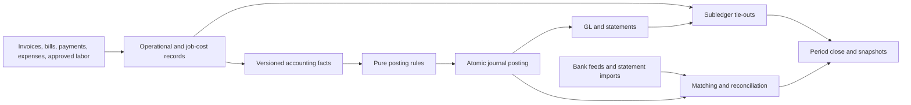

**Arc Books — accounting, engineering, and product integration review**

Reviewed September 7, 2026, America/New_York. Baseline: `94ec5e86` plus the current working tree. At the baseline check, the workspace contained 283 tracked changes and 218 untracked paths. Findings concern that working tree; they are not all claims about the deployed frontend. Selected database schema and operational observations below were verified against the connected Arc production database using SELECT-only queries. No source code, business records, settings, or migrations were changed.

**Assessment**

Arc Books has a credible accounting foundation and an unusually valuable construction operations layer. It is much more than an accounting dashboard: it contains a general ledger, immutable source facts, posting rules, bank ingestion, reconciliation, governed adjustments, debt and fixed-asset registers, tax evidence, opening balances, period close, and authority cutover.

However, the implemented controls are not yet sufficient to establish that the financial statements are correct or that daily bookkeeping can be completed reliably. I reproduced incorrect statements using the actual report functions, confirmed a broken deposit workflow against the live schema, and traced several operational costs and credits that fail to reach the same accounting records used elsewhere in Arc.

My recommendation is to preserve the architecture, correct the accounting defects first, and require demonstrated end-to-end closes before broad sole-ledger adoption. Production homebuilding needs a substantial inventory accounting extension in addition to those corrections. The presence of a production sidebar, a closing invoice, or a passing trial balance does not establish production accounting completeness.

| Area | Assessment |
|---|---|
| Ledger architecture | Strong foundation, but revision semantics and reporting have material defects. |
| Residential operations | Extensive integration; labor approval, cash/card routing, cost corrections, and month-end work remain incomplete. |
| Commercial operations | Strong operational billing and commitment model; contract presentation, revenue policy, and accounting controls need work. |
| Production operations | Rich sales/build workflow; materially incomplete land, inventory, cost relief, and warranty accounting. |
| Daily bookkeeping | Broad feature coverage; several normal user journeys cannot currently finish correctly. |
| Official ledger readiness | Not demonstrated for the complete supported workflow. One organization is already official through greenfield launch. |
| Multi-entity accounting | External routing supports richer scopes; native Books remains an organization-level ledger. Do not confuse divisions with legal entities. |

**What was examined and how much confidence to place in it**

The review followed the sidebar definitions, Books routes/actions/components, the 46 modules under `lib/services/books`, the relevant operational services, accounting adapters, migrations, SQL tests, Node tests, and reference/intent documents. Detailed checks concentrated on money creation, revision, settlement, reconciliation, reporting, and close. Repository plans were treated as intent and cross-checked against code.

The browser session was at Arc sign-in; a separate local settings tab displayed an internal server error. Consequently, the page map below is verified from navigation and route implementations, not an authenticated visual or interaction acceptance test. No payment submission, bank connection, tax filing, production close, rebuild mutation, or restore was executed. iOS was checked for Books surface presence, not audited as a complete mobile application. No comprehensive dependency-security scan, full lint/typecheck/build, or isolated pgTAP run was performed in this review.

Verification performed:

- `node --test tests/arc-books.test.js tests/books-workflow-completeness.test.js`: **93 passed**.
- Seven adjacent suites covering accounting experience, abstraction, QBO adapter, workflow completeness, native payable coding, ledger parity, and financial regressions: **116 passed, 1 failed**. Failure: `composing an invoice is an in-place takeover with a live document`, a source-text expectation in `tests/financials-regression.test.js`. This is not evidence by itself of an accounting calculation failure.
- `node scripts/check-accounting-d2-readiness.mjs`: passed; 69 direct dependencies against a baseline of 72, with a request to tighten the baseline.
- Four isolated fixtures called the real statement/conversion functions through an in-memory Supabase read adapter. They reproduced the errors described below without database writes or external I/O.
- Live SELECT queries verified table columns, bank-match constraints/triggers, workspace modes, period and export counts, latest rebuild outcomes, and recent job telemetry.

The tests include useful behavioral checks, but many workflow tests assert that strings appear in source files. For example, the deposit test verifies that debit/credit fields and `confirmBankMatch` exist; it never executes the failing database query. [Evidence](/Users/agustinzenuto/Code/Arc/tests/books-workflow-completeness.test.js:18).

**Live operational evidence**

These are observations from the connected production project, not assumptions from a release plan. They do not establish whether an organization is a customer, internal QA, or a demonstration organization.

| Observation | What it establishes |
|---|---|
| Two enabled Books workspaces: one `official` / Arc authority / disconnected external sync, one `shadow` / external authority | Official mode is already being used. The earlier description of all Books organizations being in shadow is stale. |
| One greenfield launch on September 5 ET / September 6 UTC, with `opening_position = zero` | The official workspace used the greenfield route, not the parallel cutover route. |
| One accounting period, open; no closed periods | A completed month-end close is not evidenced in this database. |
| No bank-feed connections or bank reconciliations | Successful bank-feed cron responses are not evidence of a real connected-bank workflow. |
| No Books exports, cutover runs, or cutover approvals | There is no recorded complete-export/cutover exercise here. This does not rule out backups or evidence held elsewhere. |
| Official workspace: 72 posted operational journals; latest rebuild passed, 72/72 | Real projection/rebuild work exists, but it does not exercise reversals, close, deposits, or all register flows. |
| Shadow workspace: 12 posted operational, 6 reversed operational, 7 posted reversal journals; latest rebuild failed with `missing_journal` and `journal_divergence` | Revision-related control failures are present in the live dataset. The reversed entries observed were in shadow, not the official workspace. |
| Rebuild history: 28 passed, 26 failed | A single green result is not a complete operating history. Latest per-workspace outcomes matter. |
| Last seven days: 1,008 Books projection successes, 672 bank-feed successes, 7 maintenance successes | Scheduling works. Maintenance can still report HTTP 200 while a child rebuild reports failure. |

**The accounting architecture worth keeping**

The intended flow is sound:

Several implementation choices deserve explicit credit:

- **One posting implementation.** The projector and rebuild use `draftFromFact`, reducing the chance that a verifier independently recreates a different accounting rule. Economic payload allowlists and deterministic cost-line ordering are sensible choices. [Fact drafting](/Users/agustinzenuto/Code/Arc/lib/services/books/fact-drafts.ts:21).
- **Database enforcement.** Deferred balance constraints, posted-journal guards, period guards, and journal-line scope validation exist in the live database. The source-revision RPC takes a transaction advisory lock and groups reversal, fact insertion, and replacement posting. [Atomic projection](/Users/agustinzenuto/Code/Arc/supabase/migrations/20260812120755_books_release_hardening.sql:328).
- **Billing is separated from earned revenue.** Ordinary invoices credit contract liabilities, while earned revenue is recognized separately. Production closing-basis invoices use a different posting path. The distinction is essential; the remaining problems concern measurement and presentation. [Invoice routing](/Users/agustinzenuto/Code/Arc/lib/services/books/fact-drafts.ts:255).
- **Retainage and deposits are first-class accounting concerns.** Release records have explicit classification; customer-deposit requests do not automatically become revenue, and receipt/application/refund paths exist. These should be extended, not rebuilt. [Projector classification](/Users/agustinzenuto/Code/Arc/lib/services/books/projector.ts:660), [deposit application](/Users/agustinzenuto/Code/Arc/lib/services/books/customer-deposits.ts).
- **Accounting authority is explicit.** Native, shadow, parallel, and external presentation are modeled separately. Official disconnected mode avoids making native accounting depend on a retained external provider mapping. [Authority presentation](/Users/agustinzenuto/Code/Arc/lib/services/financial-accounting.ts:13).
- **Substantive close controls exist.** GL-to-AR/AP/job-cost/retainage/deposit/debt/assets tie-outs, period locking, retained-earnings close, and statement snapshots are implemented. Their equations and completeness need correction, but the control framework is valuable. [Tie-outs](/Users/agustinzenuto/Code/Arc/lib/services/books/verifier.ts:368), [close](/Users/agustinzenuto/Code/Arc/lib/services/books/period-close.ts:887).
- **Sensitive tax identity storage is deliberate.** Taxpayer IDs use Vault-backed service RPCs; application audit events retain last-four and verification state. [Tax identity handling](/Users/agustinzenuto/Code/Arc/lib/services/books/tax-register.ts:107).
- **Scalability has received attention.** Statement journal lines are paginated, bank matching batches candidate reads, and account activity links back to financial records. These are meaningful improvements over loading arbitrary first pages.

**Sidebar and page integration map**

Books is an organization-level Office item gated by `books.read` and workspace enablement. Production navigation adds Sell and Build groupings; it does not create a separate production ledger. Inside projects, posture and module overrides determine Plan, Build, Financials, and Close items. The code explicitly accommodates mixed organizations. [Organization sidebar](/Users/agustinzenuto/Code/Arc/components/layout/app-sidebar.tsx:110), [project sidebar](/Users/agustinzenuto/Code/Arc/components/layout/project-nav-items.ts).

| Exposed area | Relationship to Books | Assessment |
|---|---|---|
| Home, Tasks, project overview | Summarize operational status and exceptions | These need accurate downstream status and links, not their own journal posting. |
| Pipeline, Bids, Plans, drawings/takeoff | Establish prospects, estimates, quantities, and commitments | Correctly not earned revenue or expense just because an estimate or bid exists. Follow conversion into contracts, budgets, and bills. |
| Purchasing, commitments, POs/VPOs | Commitments and budgets become actual cost through approved bills/expenses | Substantial integration. A PO alone should not be posted as expense. Receiving/unbilled accrual policy remains an accounting design/coverage question. |
| Billing, project Billing, pay applications | Invoice → AR/retainage/contract position → receipts/credits | Strong core linkage; affected by revision, payment routing, and revenue-policy findings. Commercial SOV/certification is operational evidence, not a substitute for GL controls. |
| Payables and project Payables | Bill approval → job cost/AP → payments/fees/returns | Strong main path; vendor credits bypass the job-cost propagation used by bills. Actual funding-account identity is not carried through all native postings. |
| Cost Inbox, Expenses, Time, T&M Tickets | Approve incurred costs and decide recoverability from the customer | The distinction between incurred cost and client billability is currently violated for labor. Card/paid-expense accounting also lacks complete funding semantics. |
| Budget, Change Orders, WIP reports | Establish revised contract, EAC, earned revenue, and operational profitability | Important integration exists. Cost corrections and direct bank categorization can make these totals disagree with Books. |
| Directory/company account | Vendor/customer financial activity, tax identity, links into Books | Useful integration; preserve permission-aware drill-through. |
| Reports | AR/AP aging, WIP, 1099, production margin and inventory analytics | These are a mixture of operational reports and ledger-derived statements. Their basis must be explicit; production margin has a concrete settlement-field defect. |
| Communities/Land/Lots | Acquisition, takedowns, development, community economics | Operational ownership transition exists; corresponding land inventory, settlement funding, development allocation, and cost relief do not form a native accounting lifecycle. |
| Sales/purchase agreements | Contract pricing, deposits, closing pipeline | Deposit accounting exists. A signed agreement should not itself recognize a house sale. |
| Starts | Gates, schedules, generated budgets and POs | Appropriate operational integration. Missing inventory accounting cannot be solved by posting the start itself as expense. |
| Design Studio/Selections | Option pricing, agreement adjustments and purchasing variances | Indirect connection through authorized pricing and costs is appropriate. Accounting must inherit those changes without creating duplicate revenue or cost. |
| Closing | Closing invoice, deposit application, receipt, lot status and warranty enrollment | Much is built; missing inventory relief and unchecked projection results prevent a complete accounting settlement. |
| Warranty | Visits, internal costs, backcharges, vendor-credit recovery | Financial bridge is incomplete: visit costs can exist only in Warranty, and generated vendor credits do not update job-cost actuals. |
| RFIs, submittals, meetings, correspondence, safety, inspections, punch, closeout | Evidence of scope, claims, completion, and potential financial consequences | Direct GL integration is generally unnecessary. Financial effects should be explicit conversions into approved cost/contract records. |
| Settings/Integrations | Enable Books, establish authority, map external providers and accounts | Useful separation. Native legal-entity scope is narrower than the external routing hierarchy. |

Books itself exposes ten sections, plus focused bank/period routes. [Section navigation](/Users/agustinzenuto/Code/Arc/app/(app)/books/books-client.tsx:701).

| Books page | Implemented | Remaining issue |
|---|---|---|
| Overview | Statements, accounting state, reconciliation findings, report links | Needs a reliable overall health result; displayed totals inherit report defects. |
| Statements | P&L, cash basis, balance sheet, trial balance, cash flow; comparisons and monthly P&L | Correctness defects; grouping is not comprehensive across community/division/entity; repeated ledger scans. |
| Banking | Accounts, imports/feeds, matching tray, rules, transaction register, deposits, reconciliation | Deposit failure, insufficient match validation, incomplete bank-to-GL reconciliation. |
| Overhead | Monthly budgets and GL actuals | Calendar-year assumptions and a silent actual-row cap. |
| Chart | Governed accounts and native registers | Register postings are useful; contra-account reporting and payroll/inventory lifecycle need work. |
| Ledger | Search, drill-through, manual proposals, recurring templates | Approval-required recurring occurrences cannot be completed through the implemented workflow. |
| Period close | Checklist, locks, recognition, snapshots, reopen, fiscal close | Year-end semantics and overstrict clearing policy; no completed live close evidence. |
| Opening balances | Structured lines, hashes, approvals, posting and reversal | Opening GL lines do not create collectible/payable/operable opening subledger items. |
| Accountant | Packages, export, tax summaries and filing evidence | Export coverage and taxable-sales calculation issues; filing integration is outside the implemented boundary. |
| Cutover | Parallel comparisons, prerequisites, approvals, authority transition, rollback; greenfield path | Substantial controls, but release acceptance is not proved by mode selection or successful launch alone. |

**Prioritized findings**

P0 means correct before relying on affected financial statements/control results. P1 means material completion or integrity work before broad sole-ledger use. P2 means meaningful operational/scale improvement. Effort includes tests: S = hours, M = several focused days, L = multiple days/weeks across domains. Risk is the risk of remediation, not the severity of the defect. H/M confidence means confirmed code/schema behavior / policy or deployment validation still required. References below are the strongest starting points; details follow.

| ID | Priority / finding | Impact | Effort / fix risk / confidence | Evidence |
|---|---|---|---|---|
| 01 | P0 — Reversed originals disappear from reports | Reversals produce negative balances instead of cancellation; historical reports change | M / high / H | [Statement filter](/Users/agustinzenuto/Code/Arc/lib/services/books/statements.ts:45) |
| 02 | P0 — Contra accounts are added with the wrong presentation sign | Assets/equity overstated; balance sheet can fail despite balanced journals | M / medium / H | [Balance sheet](/Users/agustinzenuto/Code/Arc/lib/services/books/statements.ts:280) |
| 03 | P1 — Fiscal close changes P&L and uses calendar-year assumptions | Annual/monthly performance and retained earnings can be wrong | M / high / H | [Year-end close](/Users/agustinzenuto/Code/Arc/lib/services/books/period-close.ts:1016) |
| 04 | P1 — Date changes and return-to-prior-value revisions are unsafe | Wrong-period postings or permanently failed corrections | M / high / H | [Fact identity](/Users/agustinzenuto/Code/Arc/lib/services/books/projector.ts:997) |
| 05 | P0 — Bank match writes do not validate the target journal line | False matches, cross-org references, duplicate consumption, races | M / high / H | [Confirmation](/Users/agustinzenuto/Code/Arc/lib/services/books/bank-reconciliation.ts:504) |
| 06 | P0 — Bank reconciliation does not establish a bank-to-GL balance | A zero difference can attest only to entered balances and feed movements | L / high / H | [Reconciliation close](/Users/agustinzenuto/Code/Arc/lib/services/books/bank-reconciliation.ts:613) |
| 07 | P1 — Deposit batches fail after posting | Bank movement posts but grouping/matching stays incomplete | M / medium / H | [Wrong column](/Users/agustinzenuto/Code/Arc/lib/services/books/deposit-batches.ts:199) |
| 08 | P1 — Funding-account/card identity is dropped | Wrong cash account and missing card liabilities | L / high / H | [Payment facts](/Users/agustinzenuto/Code/Arc/lib/services/books/projector.ts:799) |
| 09 | P1 — Job-cost and GL entry points are not fully unified | Vendor credits and bank-categorized costs disagree with project actuals | M / high / H | [Vendor credit](/Users/agustinzenuto/Code/Arc/lib/services/vendor-bills.ts:2714), [bank coding](/Users/agustinzenuto/Code/Arc/lib/services/books/bank-rules.ts:177) |
| 10 | P1 — Client billability approval delays incurred labor cost | Job costs/payroll accrual understated while client approval waits | M / high / H | [Labor approval](/Users/agustinzenuto/Code/Arc/lib/services/cost-plus.ts:1846) |
| 11 | P1 — Production lacks a complete inventory/land accounting lifecycle | Build-period profit, inventory, closing COGS and community economics cannot be relied on | L / high / H | [COGS-only accounts](/Users/agustinzenuto/Code/Arc/lib/services/books/projector.ts:279), [land transition](/Users/agustinzenuto/Code/Arc/lib/services/communities.ts:634) |
| 12 | P1 — Warranty visit costs have no accounting bridge | Warranty and GL/job-cost actuals diverge | L / high / H | [Visit completion](/Users/agustinzenuto/Code/Arc/lib/services/warranty-operations.ts:847) |
| 13 | P1 — Closing reports use the wrong settlement field; closing ignores returned posting failures | Closing profitability can omit final adjustments; operational success can hide accounting failure | S–M / medium / H | [Revenue reader](/Users/agustinzenuto/Code/Arc/lib/services/production-reporting.ts:200), [settlement](/Users/agustinzenuto/Code/Arc/lib/services/closings.ts:372) |
| 14 | P1 — Contract assets/liabilities are netted across projects | Balance sheet hides gross contract assets and liabilities | M / high / H | [Recognition](/Users/agustinzenuto/Code/Arc/lib/services/books/posting-rules.ts:1018) |
| 15 | P1 — Cash reports exceed their supported posting model | Noncash expense presented as cash paid; asset proceeds split incorrectly | L / high / H | [Cash basis](/Users/agustinzenuto/Code/Arc/lib/services/books/cash-basis-rules.ts:85), [cash flow](/Users/agustinzenuto/Code/Arc/lib/services/books/statements.ts:309) |
| 16 | P2 — Approval-required recurring postings stop at notification | Normal recurring journal cannot advance to approval/posting | M / medium / H | [Recurring worker](/Users/agustinzenuto/Code/Arc/lib/services/books/bookkeeping.ts:583) |
| 17 | P1 — Opening import is GL posting, not an operational migration | Imported AR/AP/deposits/assets may not be usable or tie out | L / high / H | [Opening posting](/Users/agustinzenuto/Code/Arc/lib/services/books/opening-balances.ts:315) |
| 18 | P1 — Complete export omits financial workflow tables | Export is incomplete for application continuity/restore | M / medium / H | [Export manifest](/Users/agustinzenuto/Code/Arc/lib/services/books/exports.ts:13) |
| 19 | P1 — Rebuild validation and maintenance health are misleading | Legitimate revisions fail checks; failed checks can leave cron green | M / medium / H | [Rebuild](/Users/agustinzenuto/Code/Arc/lib/services/books/rebuild.ts:56), [maintenance](/Users/agustinzenuto/Code/Arc/app/api/jobs/books-maintenance/route.ts:34) |
| 20 | P2 — Clearing-account close gate assumes every balance must be zero | Legitimate deposits in transit/unpaid payroll accrual can block close | M / high / H behavior, M policy | [Close gate](/Users/agustinzenuto/Code/Arc/lib/services/books/period-close.ts:696) |
| 21 | P1 — Tax summary labels all invoice subtotal as taxable sales | Taxable/exempt base can be materially wrong | M / medium / H | [Tax aggregation](/Users/agustinzenuto/Code/Arc/lib/services/books/accountant-package.ts:96) |
| 22 | P2 — Dimensions, aggregate caps, and repeated scans limit the accounting desk | Mixed-division analysis is incomplete; larger totals can truncate; report cost grows | M–L / medium / H | [Fact grain](/Users/agustinzenuto/Code/Arc/lib/services/books/fact-drafts.ts:72), [overhead](/Users/agustinzenuto/Code/Arc/lib/services/books/overhead-budgets.ts:22) |

**01–04: Ledger and statement correctness**

**01. Reversal semantics are inconsistent across writers and readers.** The reversal RPC posts a mirror and changes the original entry to `reversed`. Statements load only `posted`. They therefore omit the original and include the mirror. A $100 expense followed by its reversal reports **negative $100 expense**, not zero. The same status filter appears in recognized-revenue and job-cost verification reads. Historical reports before the reversal date can also lose the original transaction. Fix the accounting inclusion contract across reports, control queries, account activity and rebuild, while retaining the original and reversal as dated economic history. Do not repair this only in the P&L. [RPC](/Users/agustinzenuto/Code/Arc/supabase/migrations/20260812120755_books_release_hardening.sql:211), [revenue reader](/Users/agustinzenuto/Code/Arc/lib/services/books/revenue-recognition.ts:74).

**02. Normal balance is not the presentation sign of every account.** `accountRows` represents each balance in its normal direction; the balance sheet then adds every asset/equity balance positively. Accumulated depreciation is a credit-normal asset; owner distributions are a debit-normal equity account. These must reduce their statement categories. The real function reports a $1,000 asset with $100 depreciation as **$1,100 assets instead of $900**, producing a $200 balance-sheet difference. Introduce explicit signed presentation rules and verify all contra account types, including custom accounts. [Account signs](/Users/agustinzenuto/Code/Arc/lib/services/books/statements.ts:158), [seeded contra accounts](/Users/agustinzenuto/Code/Arc/lib/services/books/chart-of-accounts.ts:58).

**03. Year-end close needs a coherent sequence and reporting contract.** P&L does not exclude closing entries, so transferring income/expenses to retained earnings erases the annual P&L and distorts the final month. The retained-earnings function must run before closing the period; period close subsequently runs revenue recognition, so additional final-period revenue can be left outside that retained-earnings transfer. It also starts from January 1 despite configurable fiscal-year start, and skips when net income is zero even if nonzero revenue and expenses still need closing. Fix these as one fiscal-close design, with non-calendar years, zero-net-income years, final POC adjustments, and reopen/reclose tests. Standard year-end lines do **not** carry a project ID, so I did not retain the provisional claim that they necessarily reset per-project cumulative revenue recognition. [P&L](/Users/agustinzenuto/Code/Arc/lib/services/books/statements.ts:188), [fiscal start/zero check](/Users/agustinzenuto/Code/Arc/lib/services/books/period-close.ts:1059), [recognition sequence](/Users/agustinzenuto/Code/Arc/lib/services/books/period-close.ts:868).

**04. A fact's identity omits information needed to represent normal corrections.** The economic hash excludes `accountingDate`; a date-only bill/invoice correction can reuse the previous fact and posting key, leaving the transaction in its old period. Separately, the idempotency key uses source identity plus payload hash, not the transition version. A value changing A → B → A tries to reuse A's existing unique key, even though the new A is a distinct historical transition. A void/restore can encounter the same problem. Include accounting date and the appropriate transition/version semantics in identity, preserving retry idempotency for the *same* transition. Validate against the existing append-only history before migrating keys. [Hash/keys](/Users/agustinzenuto/Code/Arc/lib/services/books/projector.ts:997), [reuse branch](/Users/agustinzenuto/Code/Arc/supabase/migrations/20260812120755_books_release_hardening.sql:344), [unique constraint](/Users/agustinzenuto/Code/Arc/supabase/migrations/20260801143926_books_accounting_foundation.sql:256).

**05–08: Cash, cards, deposits and reconciliation**

**05. Bank matching validates one side only.** `confirmBankMatch` validates the bank transaction and its already matched total, then inserts the supplied journal-line ID without loading that line. It does not prove same organization, mapped bank account, correct direction, posting status, or unused amount. The read-then-insert amount check also races. The live schema has separate ID foreign keys and no accounting validation trigger for matches. This is a financial-control and authorization defect, even though ordinary suggestions may be well filtered. Make confirmation transactional with validation and locks on both sides, and test both cross-scope references and concurrent partial matches. No misuse attempt was performed. [Write boundary](/Users/agustinzenuto/Code/Arc/lib/services/books/bank-reconciliation.ts:508).

**06. Reconciliation currently proves a narrower equation than users expect.** It calculates user-entered beginning balance plus matched feed inflows/outflows, compares to user-entered ending balance, and closes if zero. It does not read the mapped GL balance, reconcile book-only outstanding checks/deposits, or establish continuity from the prior reconciled statement. Missing or duplicated GL activity can coexist with a zero result. Implement a real reconciliation statement: statement balance, book balance, identified outstanding items and adjustments, prior-period continuity, and a frozen reviewed population. Paginate the transaction population rather than trusting a 5,000-row maximum. [Current equation](/Users/agustinzenuto/Code/Arc/lib/services/books/bank-reconciliation.ts:583).

**07. Deposit creation has a confirmed schema error after the journal posts.** It queries `journal_lines.journal_entry_id`; the repository and live database column is `entry_id`. Every execution reaching that query fails to locate the bank line, after posting Dr bank / Cr undeposited funds. The batch stays unfinished and unmatched. Correct the column, but also make batch/items/journal/match/finalization an atomic or explicitly resumable unit; retries must verify persisted receipt membership rather than accept a changed request silently. Include deposit-batch journals in the rebuild's registered-source validation; its current orphan exceptions cover only debt and fixed assets. [Posting and failure](/Users/agustinzenuto/Code/Arc/lib/services/books/deposit-batches.ts:165), [rebuild exceptions](/Users/agustinzenuto/Code/Arc/lib/services/books/rebuild.ts:127).

**08. The posting rules support account overrides that source facts do not carry.** Payment facts contain amounts, fees and project but no funding-account identifier. `draftFromFact` does not pass a cash account to bill payments or AP fees. Expenses similarly omit payment-account/card identity. The resulting defaults credit Operating cash even when another bank or a card funded the transaction. A manual journal can correct it but is not an integrated lifecycle. Carry verified funding and payment-method semantics through source, fact hash, posting and reversal. Preserve the correctly implemented use of undeposited funds for customer receipts. [Payment mapping](/Users/agustinzenuto/Code/Arc/lib/services/books/fact-drafts.ts:326), [expense mapping](/Users/agustinzenuto/Code/Arc/lib/services/books/fact-drafts.ts:343), [cash defaults](/Users/agustinzenuto/Code/Arc/lib/services/books/posting-rules.ts:738).

**09–13: Operational money does not always reach the same ledger**

**09. Two examples disprove the claim that job costs and the GL always share one derivation.** `createProjectVendorCredit` inserts an approved credit and lines, then audits and enqueues external sync, without invoking the bill approval job-cost propagation. The Books projector can still book it from the header fallback. Conversely, bank categorization allows a project COGS debit and posts directly to GL, without creating an expense/job-cost source. The verifier compares all project COGS against `job_cost_entries`, so these paths cause genuine differences. Route financial actuals through an owned source lifecycle or introduce an explicit reconciled adjustment subledger. Merely excluding them from the verifier would hide the missing project costs. [Credit lifecycle](/Users/agustinzenuto/Code/Arc/lib/services/vendor-bills.ts:2792), [fallback](/Users/agustinzenuto/Code/Arc/lib/services/books/projector.ts:630), [control definition](/Users/agustinzenuto/Code/Arc/lib/services/books/verifier.ts:74).

**10. Customer approval should not decide whether wages were incurred.** PM-approved time calls `propagateApprovalToLedger` only when client cost approval is not required. If client approval is required, the labor cost can remain outside job-cost actuals and Books while its recovery from the client is disputed or pending. Separate employer cost recognition from billable-cost approval. Payroll settlement should then relieve the accrued liability independently of invoice collection. No dedicated payroll-clearing settlement/import workflow was found; manual adjusting journals are currently the available accounting mechanism. [Approval condition](/Users/agustinzenuto/Code/Arc/lib/services/cost-plus.ts:1846), [payroll accrual rule](/Users/agustinzenuto/Code/Arc/lib/services/books/posting-rules.ts:944).

**11. Production changes revenue timing but does not complete inventory accounting.** Closing basis changes invoice posting, while project bill/expense cost account resolution is restricted to COGS and labor defaults to 5030. A construction-in-progress account exists but there is no corresponding native build-cost accumulation and sale-cost-relief lifecycle. Land takedown completion changes ownership/status/date without a linked acquisition/settlement journal. Build the accounting lifecycle around owned land, development costs, homes under construction, completed unsold homes, and sold-home cost relief. Define approved allocation of shared community costs and eligible interest; do not expense every cost until closing and then attempt to infer historical inventory from a margin report. This is a major domain gap, not a small posting tweak. [Basis switch](/Users/agustinzenuto/Code/Arc/lib/financials/billing-model.ts:68), [cost classification](/Users/agustinzenuto/Code/Arc/lib/services/books/projector.ts:279), [land close](/Users/agustinzenuto/Code/Arc/lib/services/communities.ts:608).

**12. Warranty costs need an explicit accounting owner.** Visit completion stores internal labor/material totals and emits events but does not create a time/expense/AP/job-cost record or Books posting. Therefore Warranty can show a cost that the GL never incurred. Decide whether visit fixgures are estimates or approved actuals, link approved actuals to source records, prevent double booking when a trade invoice later arrives, and connect recoveries through the corrected vendor-credit lifecycle. A warranty reserve, its consumption and later estimate revisions are additional production accounting design work. [Visit completion](/Users/agustinzenuto/Code/Arc/lib/services/warranty-operations.ts:852).

**13. Closing has two concrete integration defects.** `settleClosing` stores a settlement with `finalPriceCents`, but production reporting reads `final_price_cents` and falls back to the contract total. Closing adjustments can disappear from reported margin. Also, `projectJournal` returns per-source failures instead of throwing every failure; `settleClosing` ignores the result and marks the closing closed. Fix the settlement DTO contract and expose durable posting state for the specific closing sources. Do not block a closing because an unrelated organization's or project's source failed, and do not imply that ledger posting proves actual receipt of funds. [Writer](/Users/agustinzenuto/Code/Arc/lib/services/closings.ts:325), [reader](/Users/agustinzenuto/Code/Arc/lib/services/production-reporting.ts:200), [failure contract](/Users/agustinzenuto/Code/Arc/lib/services/books/projector.ts:1291).

**14–15: Construction presentation and cash reporting**

**14. Contract assets and liabilities need per-contract presentation.** Recognition debits account 2350; an underbilled project becomes a debit in that liability account. The balance sheet aggregates at account level, allowing one project's asset to offset another project's liability. The 1150 account is seeded but the automatic reclassification is absent. For a $150,000 underbilled contract and a $50,000 overbilled contract, the aggregate can show a negative $100,000 liability rather than $150,000 contract assets and $50,000 contract liabilities. Implement per-contract presentation or controlled period-end reclassifications with correct subsequent reversals. This is consistent with the contract-level presentation and offsetting discussion in [FASB's revenue-recognition implementation Q&A, Questions 61–63](https://storage.fasb.org/Rev_Rec_Implementation_QAs.pdf). The precise contract/performance-obligation and offsetting policy should be approved for Arc's supported customer arrangements.

**15. Cash-basis and cash-flow statements need different, complete models.** The cash-basis bridge adjusts AR/AP, retainage, deposits, contract liabilities and payroll clearing, but treats other expenses as cash paid. A $100 depreciation-only journal therefore produces **$100 cash paid despite no cash movement**. Tax-basis profit and cash receipts/disbursements are different outputs: depreciation may belong in a tax computation without being a cash payment. Separately, cash flow allocates by the gross magnitude of noncash counterpart lines. Selling an $800 carrying-value asset for $1,000 allocates $800 investing / $200 operating under that rule, although the $1,000 sale receipt belongs to the asset-disposal investing flow. Use event-aware classifications and an explicit supported cash/tax bridge. Tax method eligibility and capitalization/recovery rules cannot be inferred from the UI toggle; [IRS Publication 334](https://www.irs.gov/publications/p334) describes separate accounting-method and cost-recovery considerations. [Cash conversion](/Users/agustinzenuto/Code/Arc/lib/services/books/cash-basis-rules.ts:66), [allocation](/Users/agustinzenuto/Code/Arc/lib/services/books/cash-flow-rules.ts:40), [asset disposal lines](/Users/agustinzenuto/Code/Arc/lib/services/books/registers.ts:674).

**16–21: Completing the accountant's operating workflow**

**16. Recurring journals default to an unfinished approval path.** UI creation defaults auto-post off; the worker sends a due notification and stops without creating an occurrence proposal or advancing `next_run_on`. The rendered template controls offer Pause/Resume, not approve/post this occurrence. Add a durable occurrence with proposal, reviewer decision, posting key, and advancement after resolution. Reusing the normal manual-proposal workflow is preferable to a second approval system. [UI default](/Users/agustinzenuto/Code/Arc/components/books/books-journals.tsx:490), [worker](/Users/agustinzenuto/Code/Arc/lib/services/books/bookkeeping.ts:583), [template actions](/Users/agustinzenuto/Code/Arc/components/books/books-journals.tsx:713).

**17. Opening balances need operational continuity.** The importer stores descriptive subledger types and source detail, but posting maps those lines into a GL journal. It does not itself materialize unpaid invoices, payable bills, unapplied customer deposits, debt schedules or fixed-asset opening registers. A $10,000 AR opening balance with a customer tag is not yet a $10,000 invoice the Billing desk can collect and age. Design an import package that reconciles GL openings with operational open items, suppresses duplicate projection of imported history, and proves the first subsequent receipt/payment. This finding is a migration-workflow gap; it does not mean every existing opening batch is wrong. [Opening input](/Users/agustinzenuto/Code/Arc/lib/services/books/opening-balances.ts:18), [posting map](/Users/agustinzenuto/Code/Arc/lib/services/books/opening-balances.ts:315).

**18. Complete export needs a versioned completeness contract.** `EXPORT_TABLES` omits deposit batches/items, multi-invoice receipt groups/items, and overhead budgets/lines, although those tables are in the live schema and used by the application. Journal balances alone cannot reconstruct their workflow associations. Add all supported financial dependencies, document deliberately excluded credentials/identity data, and prove an isolated restore with relationships and file checksums intact. A full database backup is a different continuity mechanism and may cover these tables; it does not make the application export complete. [Manifest](/Users/agustinzenuto/Code/Arc/lib/services/books/exports.ts:13).

**19. The rebuild and job-health results need to agree.** Rebuild iterates all non-retirement facts, including superseded versions, but searches for posted journals only. Superseded originals therefore become `missing_journal`. Deposit-batch operational entries also lack a recognized register exception. Meanwhile, maintenance derives its HTTP status only from projection failures and ignores returned failed rebuild results. Live data shows exactly that combination: failed shadow rebuild and successful maintenance. Define active fact selection versus historical replay explicitly, validate registered native events, run repair and verification in a deliberate order, and aggregate child outcomes into health. A replay matching the same defective posting function still does not establish accounting correctness; scenario assertions remain necessary. [Rebuild selection](/Users/agustinzenuto/Code/Arc/lib/services/books/rebuild.ts:56), [job status](/Users/agustinzenuto/Code/Arc/app/api/jobs/books-maintenance/route.ts:21).

**20. The clearing gate conflates reviewed balances with zero balances.** The close label says reviewed, but any nonzero 1010 or 2200 balance fails a blocking check. A month-end receipt deposited next month or accrued payroll paid next month can be a legitimate balance. Forcing it to zero can encourage incorrect backdating or fictitious transfers. Replace this with reconciled, aged, supported balances and explicit exceptions/policy where needed. Material unexplainable balances should still block close. [Balances](/Users/agustinzenuto/Code/Arc/lib/services/books/period-close.ts:485), [blocking check](/Users/agustinzenuto/Code/Arc/lib/services/books/period-close.ts:696).

**21. Taxable sales are not the same as invoice subtotal.** The jurisdiction summary adds every included invoice's entire subtotal into `taxableSalesCents`; it never reads taxable line bases. Exempt work and mixed taxable/non-taxable invoices can therefore produce the wrong taxable-sales figure even if invoice tax itself was computed correctly. Derive taxable and exempt amounts from the invoice tax basis and include adjustment/refund treatment. The current warning that this is a summary is appropriate, but does not make the mislabeled amount correct. Tax calculation, jurisdiction selection, filing evidence and actual remittance should remain distinct states. [Query](/Users/agustinzenuto/Code/Arc/lib/services/books/accountant-package.ts:33), [aggregation](/Users/agustinzenuto/Code/Arc/lib/services/books/accountant-package.ts:96).

**22: Reporting dimensions, scope, scale and maintainability**

The journal supports project/company plus JSON dimensions, but projected cost facts reduce their grain to amount, project, description and optional account code. Cost code, cost type, lot, community and division are not a consistent posting contract. Native statements have no legal-entity/group-by interface comparable to the external accounting route hierarchy. The P&L does expose project breakdowns; this is useful and should not be described as missing. [Fact grain](/Users/agustinzenuto/Code/Arc/lib/services/books/fact-drafts.ts:72), [statement request](/Users/agustinzenuto/Code/Arc/lib/services/books/statement-detail.ts:131).

Books read services authorize an organization-level permission and use service-role queries. They do not apply the division scope returned by authorization. **Investigate the permission contract before claiming a leak:** an organization-wide accountant role may intentionally see all divisions. If custom division-restricted roles can receive `books.read`, enforce their scope or explicitly reserve that permission for whole-ledger access. Do not silently offer a division lens that appears to constrain confidential data but only changes operational desks. [Books authorization](/Users/agustinzenuto/Code/Arc/lib/services/books/workspace.ts:45), [authorization scope](/Users/agustinzenuto/Code/Arc/lib/services/authorization.ts:608).

Overhead actuals use a 10,000-row cap without a truncation result; tax summary queries are unpaginated; the bank reconciliation close caps its population. These are unacceptable places to present a partial aggregate as a total. The statement page also invokes separate full-ledger reads for P&L, balance sheet, trial balance, cash flow, cash basis, comparison, and each requested month. Correct paging should be preserved, but shared as-of read models or database aggregation would reduce load and inconsistent read windows. [Overhead](/Users/agustinzenuto/Code/Arc/lib/services/books/overhead-budgets.ts:17), [statement fan-out](/Users/agustinzenuto/Code/Arc/lib/services/books/statement-detail.ts:181).

The 2,000-plus-line Books client combines onboarding, operational banking, period close, tax and cutover. Breaking it into route-owned sections would improve maintenance and testing, but this should follow correctness fixes. Do not spend the next release primarily reorganizing UI files while leaving wrong statement totals intact.

**Posture-specific accounting judgment and remaining design work**

**Residential.** Fixed-price billing, cost-plus, GMP and T&M are represented in the financial model. Books maps every non-closing project to cost-to-cost POC; it does not have separately selected recognition policies for all those billing models. I did not confirm the older allegation that cost-plus/T&M are categorically excluded from recognition: the current code does compute POC inputs generically. The real limitation is that an operational billing model is not an accountant-approved revenue measurement policy. Specify how eligible T&M/right-to-invoice arrangements, fixed fees, GMP limits, variable consideration, owner allowances and nonrecoverable costs affect revenue. Preserve the distinction between job cost, billable cost and revenue. [Basis resolver](/Users/agustinzenuto/Code/Arc/lib/financials/billing-model.ts:68), [POC inputs](/Users/agustinzenuto/Code/Arc/lib/services/poc.ts:40).

**Commercial.** The SOV, pay-application, retainage, change-order and commitment workflows provide much of the needed operational evidence. The accounting additions should focus on contract-level assets/liabilities, approved estimates and anticipated-loss handling, disputed/unapproved change-order policy, stored-materials treatment, and lender/surety WIP that reconciles to the GL. Equipment costing, payroll burden and joint-payee disbursement deserve explicit supported scenarios; an account named Equipment costs is not an allocation system. These are policy/design workstreams, not claims that every commercial contract currently misstates revenue.

**Production.** Treat land and homes held for sale as a distinct inventory lifecycle. Connect land acquisition, development allocations, house costs, completed spec inventory, closing cost relief, seller adjustments, loan releases and warranty reserves to the ledger. Preserve lot/community/division attribution across changes. Operational projected margin should remain useful before a sale, but must be labeled and reconciled separately from recognized accounting profit. The complete sale is more than Dr AR / Cr revenue.

**Boundaries that should remain explicit.** Single legal entity, USD and an accrual GL are coherent first-release limits. External banking, payment processors, payroll calculation and tax transmission are reasonable specialized services; Arc does not need to build them all. What Arc does need is complete entry/settlement/reconciliation interfaces for the services it supports. Native multi-currency, consolidation, tax filing and payroll calculation are product expansion choices, not all defects to fix in the next sprint.

**Older findings considered and rejected or qualified**

- POC snapshot scheduling is **implemented**: `captureNightlyForecastSnapshots` calls `captureProjectPocSnapshot`, and the forecast-snapshot job is scheduled. Historical completeness and successful execution still need evidence. [Implementation](/Users/agustinzenuto/Code/Arc/lib/services/forecast-snapshots.ts:37).
- Statement comparisons are **implemented**: prior-year/prior-period selection and monthly P&L exist. Broader dimensional grouping remains incomplete. [Implementation](/Users/agustinzenuto/Code/Arc/lib/services/books/statement-detail.ts:146).
- Customer receipts already use **undeposited funds**; the missing piece is reliable bank settlement/clearing, not creating account 1010 or changing every receipt again.
- Manual journal proposals, debt/fixed-asset registers, tax jurisdiction records and greenfield launch **exist**. Do not plan to rebuild them based on older documents.
- A commitment/PO, sales agreement, start release, drawing or inspection should not automatically create an expense/revenue journal merely because it exists.
- Direct COGS for an over-time service contract is not automatically the same error as expensing inventory costs of an unsold spec home. Revenue presentation and inventory accounting must be judged separately.
- External provider scope does not prove native legal-entity support. Likewise, the existence of a file adapter does not prove a second live accounting provider is production-ready.
- The reference revenue-entry document is dated August 7 and still describes receipts into Operating cash and cash-basis reporting as absent. Both have changed. Its blank sign-off block is not proof that no accountant has ever reviewed Arc, but it is not current acceptance evidence. [Reference drift](/Users/agustinzenuto/Code/Arc/docs/books-revenue-recognition.md).

**Recommended delivery order and acceptance evidence**

1. **Stabilize the financial truth.** Correct 01–04 and add behavioral fixtures against real statement readers and the actual SQL projection/reversal functions. Acceptance: debit/credit balance plus expected account balances across original → revision → reversal → restore, historical as-of dates, contra accounts and fiscal close. A balanced wrong entry must fail the tests.
2. **Complete bank operations.** Correct 05–08 and 20. Acceptance: two funding banks, a card purchase/payment, fees, partial matches, duplicate/concurrent requests, multi-receipt bank deposit, a deposit in transit, an outstanding check, and a complete bank-to-GL reconciliation. The builder must be able to finish the workflow without corrective ad hoc journals.
3. **Unify actual-cost lifecycles.** Correct 09–10 and 12–13. Acceptance: vendor credit, bank-origin job cost, client-disputed labor, warranty cost/recovery and a retryable closing all appear consistently in source record, job costs, GL, party activity and reports.
4. **Finish the accountant's month-end and migration journey.** Correct 14–19 and 21; establish signed revenue/tax/reporting policies. Acceptance: complete opening AR/AP/retained amounts, first receipt/payment, one month close/reopen, non-calendar fiscal close, and restored export with operational links intact. Rebuild failures must show as failed health.
5. **Add production accounting as a dedicated domain release.** Implement 11 with policy-approved entry sets and durable dimensions. Acceptance: acquired land → developed lots → started home → unsold completed home → sale → warranty, including community allocation and actual closing cost relief. Prove both inventory valuation and GL/job-cost/operational report reconciliation.

After these foundations, three sensible product directions are a unified accounting health desk, community/division analysis backed by consistent dimensions, and provider-specific payroll/tax handoff packages. Each builds on implemented infrastructure. A second live accounting adapter or a large Books UI redesign should not displace correction of the financial numbers.

This is an assessment and sequencing recommendation, not authorization to alter an official ledger or apply migrations. The next implementation work should start from the current source and a verified database baseline, with accounting policy decisions recorded alongside the tests that enforce them.
